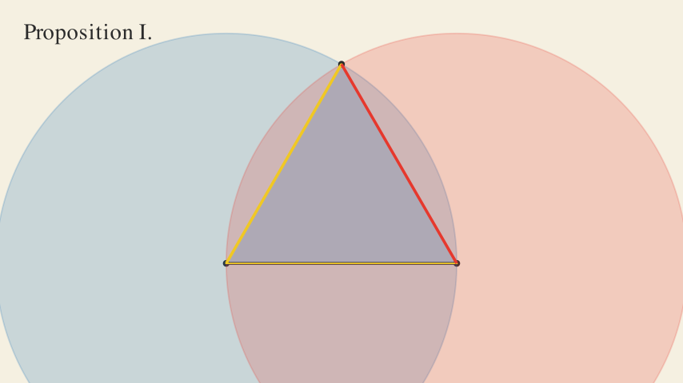

# byrne-euclid-manim

Animated Euclidean geometry in the style of Oliver Byrne’s 1847 *Euclid*, aligned to the English national curriculum.



## What this repo does

This project renders short geometry animations with Manim Community Edition using Byrne’s four-colour visual language on a warm cream background.

The current catalogue covers a design-system reference card, foundational definitions and postulates, ruler-and-compass constructions, and key angle theorems from Book I. Output is produced as MP4, PNG, and square GIF artefacts so the scenes can be used in classrooms, slide decks, blog posts, and curriculum tooling.

## Scene catalogue

### Design system

- `PaletteCard`

### Definitions and postulates

- `DefPointLineStraightLine`
- `DefAngleTypes`
- `DefCircle`
- `DefTrianglesBySide`
- `DefTrianglesByAngle`
- `DefQuadrilaterals`
- `DefParallelLines`
- `PostulateI`
- `PostulateII`
- `PostulateIII`

### Constructions

- `PropI`
- `PropII`
- `PropIII`
- `PropIX`
- `PropX`
- `PropXI`
- `PropXII`

### Angle theorems

- `PropXIII`
- `PropXV`
- `PropXXXII`

## Quickstart

### Prerequisites

- `uv`
- `ffmpeg`
- `cairo`
- `pango`

On macOS:

```bash path=null start=null
brew install ffmpeg cairo pango
```

On Debian or Ubuntu:

```bash path=null start=null
sudo apt-get update
sudo apt-get install -y ffmpeg libcairo2-dev libpango1.0-dev
```

### Install dependencies

```bash path=null start=null
uv sync
```

### Render a single scene

```bash path=null start=null
uv run python scripts/render_one.py PropI
uv run python scripts/render_one.py DefAngleTypes --format png
```

### Render the full catalogue

```bash path=null start=null
uv run python scripts/render_all.py --quality l
bash scripts/gif_convert.sh
```

### Build curriculum artefacts

```bash path=null start=null
uv run python scripts/build_manifest.py
```

### Build the synthetic curriculum preview

```bash path=null start=null
uv run python scripts/build_demo_curriculum_preview.py
```

If you have an Oak API key available locally under `OAK_OPEN_API_KEY` or `OAK_API_KEY`, refresh the cached curriculum data without exposing the key:

```bash path=null start=null
uv run --env-file .env python scripts/fetch_oak_curriculum.py
```

## Output layout

- `output/mp4/` — rendered MP4 animations
- `output/png/` — final-frame stills
- `output/gif/` — square GIF conversions
- `curriculum/curriculum_manifest.json` — programmatic curriculum manifest
- `docs/curriculum_mapping.md` — human-readable curriculum view
- `curriculum/demo_curriculum_manifest.json` — synthetic preview manifest showing the final enriched shape without live Oak auth
- `docs/demo_curriculum_mapping.md` — synthetic preview of populated lesson and thread links
- `docs/demo_curriculum_showcase.md` — synthetic showcase of media paths, keywords, misconceptions, and curriculum notes

## Curriculum alignment

The mapping lives in `curriculum/euclid_to_oak.yaml` and is compiled into:

- `curriculum/curriculum_manifest.json`
- `docs/curriculum_mapping.md`

While live Oak auth is blocked, a hand-authored preview of the final enriched packaging can be generated from:

- `curriculum/demo_curriculum_preview.yaml`
- `curriculum/demo_curriculum_enrichment.json`
- `docs/demo_curriculum_mapping.md`
- `docs/demo_curriculum_showcase.md`

The alignment currently covers KS2 and KS3 geometry, especially:

- properties of shapes
- angle vocabulary and angle facts
- ruler-and-compass constructions
- triangle angle sums

## Working locally

### Tests

```bash path=null start=null
uv run pytest tests/
```

### Lint

```bash path=null start=null
uv run ruff check src/ scripts/ tests/
```

### Typical loop

```bash path=null start=null
uv run pytest tests/test_scene_catalogue.py
uv run python scripts/render_one.py PropIX --quality l
uv run ruff check src/ scripts/ tests/
```

## Project guide

- `src/byrne_euclid/style.py` — palette, scene helpers, shared animation idioms
- `src/byrne_euclid/utils.py` — geometry helpers
- `src/byrne_euclid/definitions.py` — definition scenes and `PaletteCard`
- `src/byrne_euclid/postulates.py` — postulate scenes
- `src/byrne_euclid/propositions.py` — proposition scenes
- `src/byrne_euclid/rendering.py` — registry and render plumbing
- `scripts/` — render, GIF, curriculum, and manifest tooling
- `docs/style_guide.md` — visual design rules
- `docs/curriculum_mapping.md` — curriculum mapping
- `references/` — source attribution and curriculum PDFs

## For teachers

The intended classroom flow is simple:

1. Render or download the scene you need
2. Use the MP4 in slides or the GIF in docs and LMS content
3. Cross-check the linked curriculum note in `docs/curriculum_mapping.md`

The animations are visual aids. They are built to support explanation rather than replace it.

## Contributing

See `CONTRIBUTING.md` for the practical workflow and `docs/style_guide.md` for the non-negotiable visual rules.

## Credits

- Oliver Byrne
- William Pickering
- Mary Byfield
- Nicholas Rougeux and `c82.net`
- Sergey Slyusarev / `jemmybutton`
- Manim Community Edition
- Oak National Academy

## Licence

- Code: MIT
- Rendered animations: intended for CC-BY 4.0 distribution
- Curriculum source material: Open Government Licence v3.0
