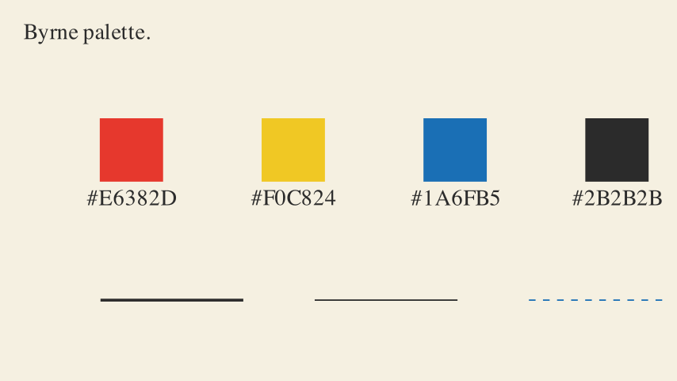

# Style guide

This document locks the visual language for every scene in the catalogue.

## Palette

Use only the shared constants from `src/byrne_euclid/style.py`.

- `BYRNE_RED` — `#E6382D`
- `BYRNE_YELLOW` — `#F0C824`
- `BYRNE_BLUE` — `#1A6FB5`
- `BYRNE_BLACK` — `#2B2B2B`
- `BYRNE_BG` — `#F5F0E1`

## Colour usage

- Use black for anchors, base lines, and neutral structure.
- Use red, yellow, and blue to separate major geometric roles.
- Keep colour meaning stable within a scene once introduced.
- Avoid introducing decorative colours or gradients.

## Stroke rules

- Primary result geometry uses the thick stroke.
- Construction and auxiliary geometry uses the thin stroke.
- Dashed lines are reserved for construction scaffolding or implied continuation.
- Right-angle marks stay thin and precise.

Current defaults:

- `BYRNE_THICK = 6.0`
- `BYRNE_THIN = 3.0`
- `BYRNE_DASH_LENGTH = 0.15`
- `BYRNE_DASH_RATIO = 0.5`

## Fill opacity

- Shape fills should stay light enough that the outline remains dominant.
- Angle sectors should read clearly without becoming blobs.
- Construction circles can fade rather than disappear instantly once the result is established.

Current working range:

- polygons: about `0.2`
- angle sectors: about `0.35`
- softened construction geometry: about `0.2`

## Timing

The scene should feel deliberate and calm.

- Simple line creation: about `1.0s`
- Compass sweep: about `1.5s`
- Angle mark appearance: about `0.6s`
- End hold: `2.0s`

If a viewer cannot follow the construction at first watch, slow it down.

## Typography

- Titles sit in the upper-left corner.
- Text is sparse and functional.
- The title font size is currently `34`.
- Prefer naming the Euclid item once rather than narrating the full proof in text.

## Composition

- Compose scenes for `16:9` first.
- Keep the main construction centred and legible.
- Allow clear negative space around the working geometry.
- Square GIFs are derived by centre-cropping the MP4 output in post-processing.

## Motion rules

- Use `Create` for lines, circles, and arcs that should feel drawn.
- Use `FadeIn` for labels, dots, and angle sectors where the object is being revealed rather than traced.
- Fade or dim scaffolding once the target result is clear.
- Hold the finished state long enough for a teacher to pause on it.

## Do

- Keep the page calm.
- Use one visual idea at a time.
- Let the result dominate the final frame.
- Reuse shared helpers so scenes feel related.

## Don’t

- Don’t crowd the frame with labels.
- Don’t mix multiple competing highlight colours without a reason.
- Don’t leave every construction circle at full opacity once the proof moment has landed.
- Don’t chase novelty in motion. Clarity wins.

## Accessibility note

Byrne’s palette is distinctive and useful, but it is not fully colour-blind-safe on colour alone.

The scenes therefore also rely on:

- stroke thickness
- dash pattern
- position
- sequencing

A colour-blind-safer alternative palette remains a sensible follow-on improvement for a later phase.
